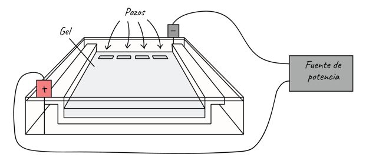

## Visualización por electroforesis  
tomado de Electroforesis de ADN por  Francisco Fierro Fierro  

Equipo a usar:  
 - Cámara horizontal de electroforesis con los accesorios correspondientes (molde para hacer el gel, peine, cables para conectar a la fuente de alimentación)  
 - Fuente de alimentación o de poder.  

Reactivos:  
Agarosa, Tris base (2-amino-2-(hidroximetil)-1,3-propanodiol, Ácido acético glacial, EDTA (ácido etilendiaminotetraacético, Ácido bórico, NaOH (hidróxido de sodio), Glicerol, Azul de bromofenol, Xileno cianol,  Bromuro de etidio.  

Buffer TAE (50x) 1 L:  
 Tris base, 242 g; ácido acético glacial, 57.1 ml; 0.5 M EDTA pH 8, 100 ml. Ajustar hasta 1 litro con agua destilada o desionizada.  

Buffer de carga tipo II (6x):   
0.25% azul de bromofenol; 0.25% xileno cianol; 30% glicerol, en agua. Almacenar a 4°C.  

Bomuro de etidio:  
El bromuro de etidio (BrEt) es un agente intercalante (se intercala entre las bases nitrogenadas) que se usa como colorante fluorescente para la visualización de ácidos nucleicos en geles de agarosa y poliacrilamida. El BrEt absorbe luz ultravioleta de λ ≈ 300 nm, y emite una luz anaranjada de 590 nm, mediante la cual podemos observar la posición y cantidad relativa del ADN en el gel tras la electroforesis. La solución stock de BrEt se prepara a una concentración de 10 mg/ml en agua, y se conserva a temperatura ambiente o a 4°C en un tubo envuelto en papel de aluminio. Debemos tener mucho cuidado con esta sustancia, para no tener contacto con ella siempre usaremos guantes.  

Pasos de la electroforesis:  

### 1.- Preparación del gel de agarosa   

1.1. Pesar la cantidad de agarosa necesaria para obtener la concentración deseada (en nuestro caso es 1 g para 100 ml quedando a una concentración del 1%) en función del volumen de gel.   

1.2. Añadir la agarosa al buffer (TAE 1x) en un matraz.   

1.3. Calentar la mezcla en un horno de microondas hasta que se observe que toda la agarosa se ha fundido.   

1.4. Dejar enfriar la solución de agarosa hasta una temperatura de unos 50 °C (Nota: si se opta por añadir el BrEt al gel debe realizarse en este momento, a una concentración final de 0.5 µg/ml).  

 1.5. Mientras la solución de agarosa se enfría, preparar el molde en el que se va a hacer el gel sellando los bordes con cinta masking, o colocándolo en el dispositivo previsto para ello, y colocando el peine en la posición deseada.   

1.6. Verter cuidadosamente la solución de agarosa sobre el molde nivelado y dejar que solidifique durante al menos 30 min.   

### 2. Preparación de las muestras   

2.1. Mezclar tanto las muestras de ADN como el marcador de tamaño con 0.2 volúmenes del buffer de carga 6x. El volumen total estará determinado por el tamaño de los pocillos, habitualmente 15-30 µl.   

   
Figura 4: Esquema de una electroforesis: En la imagen se muestra la dispoción de gel de agarosa horizontal y los pozos donde se cargan las muestras a visualizar.  

### 3. Carga de las muestras y corrida del gel  

3.1. Una vez que el gel ha solidificado retirar el sellado de los bordes y colocar el molde con el gel en la cámara de electroforesis (como se muestra en la figura 4).   

3.2. Añadir buffer de electroforesis (TAE 1x o TBE 0.5x) hasta que cubra el gel unos 3-5 mm.   

3.3. Retirar cuidadosamente el peine para que queden libres los pocillos para las muestras.   

3.4. Cargar en los pocillos las muestras.  

3.5. Conectar los cables a la fuente alimentación y aplicar un voltaje de 20-150 V (1-5 V/cm de acuerdo a la distancia entre los electrodos). El ajuste del voltaje es muy variable dependiendo de la cámara y de los tamaños que se pretenden separar, se recomienda voltajes no muy altos para tamaños muy grandes del ADN.   

3.6. Correr el gel hasta que el colorante azul de bromofenol esté a una distancia del borde de aproximadamente un 25% de la longitud total del gel. En ese momento debe detenerse la electroforesis.  

### 4. Tinción del gel y visualización del ADN  

 4.1. Si no se añadió el BrEt al gel, éste debe teñirse una vez finalizada la electroforesis.   

4.2. Colocar el gel sobre un transiluminador y encender la lámpara de luz ultravioleta (λ ≈ 300 nm), el ADN se visualizará como bandas de color anaranjado.  

