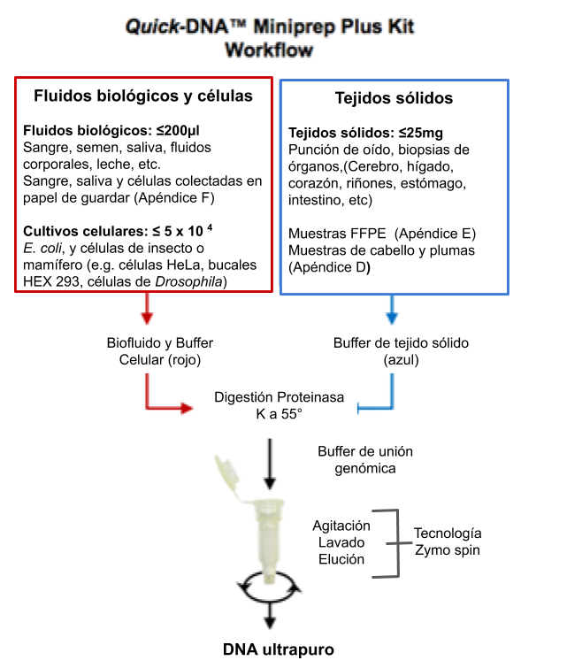

# Metodología  

## Protocolo de extracción de ADN  

Para la extracción del ADN de fluido corporal se usará el protocolo del Quick-DNA Miniprep Plus Kit, el diagrama de esta metodología se presenta en la Figura 3. Como se puede apreciar con este protocolo se puede obtener ADN tanto de fluidos biológicos incluyendo sangre, semen, saliva y otros, así como de tejidos sólidos. 

    
Figura 3.  Diagrama de flujo del protocolo de extracción de ADN del kit producido por la empresa Zymo Research.  
  
Pasos a seguir para la extracción:  
1. Ponga en un tubo de eppendorf (1.5 ml) hasta 200 µl de muestra y agregue:   
-200 µl de BioFluid y Buffer Celular (Rojo) y 20 µl de proteinasa K.  

Nota: Para una cantidad menor a los 200 µl de fluido biológico, disminuya proporcionalmente BioFluid & Cell Buffer (Red), Proteinasa K  y Genomic Binding Buffer.  
2. Mezclar bien (usar vortex leve) y luego incubar el tubo a 55ºC durante 10 minutos.  

3. Agregue 420 µl de Genomic Binding Buffer a la muestra digerida. Mezclar bien.  

4. Transfiera la mezcla a una columna Zymo-Spin ™ IIC-XL en un tubo de recolección (los que vienen en el kit). Centrifugar (≥ 12,000 x g) durante 1 minuto.  

Deseche el tubo de recolección junto con el fluido.  

5. Agregue 400 µl de DNA Pre-Wash Buffer a la columna en un nuevo tubo de recolección de 1.5 ml y centrifugue durante 1 minuto. Vaciar el Tubo de recolección.   

No olvide rotular correctamente el tubo.  

6. Agregue 500 µl g-DNA Wash Buffer y centrifugue durante 1 minuto. Vaciar el tubo de recolección.   

7. Agregue 200 µl de g-DNA Wash Buffer y centrifugue durante 1 minuto. Deseche el tubo de recolección junto con el fluido.  

8. Para eluir el ADN, transferir a un tubo limpio de microcentrífuga (1.5 ml). Agregue ≥ 50 µl de tampón de elución de ADN (mínimo 35 µl), incubar durante 5 minutos a temperatura ambiente, y luego centrifugar durante 1 minuto.  

## Cuantificación del ADN   

Equipo a usar: Nanodrop.  
1. Haga doble clic en el icono de escritorio softwere NanoDrop 2000 y seleccione la aplicación de intereses.  

2. Selecciones el ensayo que vaya a realizar: Nuecleic Acid, Protein A280, etc. Aquí seleccione ADN.  

3. Una vez realizada esta operación aparecerá el siguiente cuadro de diálogo: “Routine verification of measured wavelengths needs to be done. Make sure the arm is down and click ok to start the verification”. A continuación pulsar OK.  

4. Establecer un blanco con el tampón adecuado (usaremos la solución de elución del kit). Tomar 1-2 ul del blanco y depositarla en la parte inferior del pedestal, baje el brazo y haga clic en el botón que indica Blanc. Generalmente se usa como blanco el mismo tampón donde la molécula de interés se haya suspendido o disuelto.  

5. Limpie el pedestal e introduzca el ID de la muestra en el campo correspondiente. Pipetear 1 ul de la muestra y medir. - Se recomienda siempre tomar una nueva alícuota de la muestra para cada medición. Después de una medición: - Limpie los pedestales de medición con un paño de laboratorio que no suelte pelusa. El instrumento está listo para la siguiente muestra.  

6. Registren la concentración de cada muestra.  
