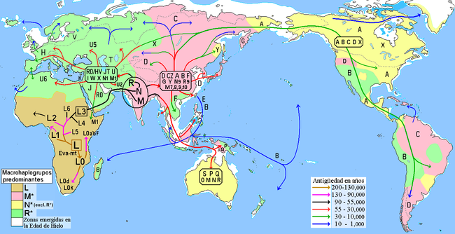

# Metodología  

## Protocolo de extracción de ADN  

Para la extracción del ADN de fluido corporal se usará el protocolo del Quick-DNA Miniprep Plus Kit, el diagrama de esta metodología se presenta en la Figura 3. Como se puede apreciar con este protocolo se puede obtener ADN tanto de fluidos biológicos incluyendo sangre, semen, saliva y otros, así como de tejidos sólidos. 

    
Figura 3.  Diagrama de flujo del protocolo de extracción de ADN del kit producido por la empresa Zymo Research.  
  
Pasos a seguir para la extracción:  
1. Ponga en un tubo de eppendorf (1.5 ml) hasta 200 µl de muestra y agregue:   
-200 µl de BioFluid y Buffer Celular (Rojo) y 20 µl de proteinasa K.  

Nota: Para una cantidad menor a los 200 µl de fluido biológico, disminuya proporcionalmente BioFluid & Cell Buffer (Red), Proteinasa K  y Genomic Binding Buffer.  
2. Mezclar bien (usar vortex leve) y luego incubar el tubo a 55ºC durante 10 minutos.  

3. Agregue 420 µl de Genomic Binding Buffer a la muestra digerida. Mezclar bien.  

4. Transfiera la mezcla a una columna Zymo-Spin ™ IIC-XL en un tubo de recolección (los que vienen en el kit). Centrifugar (≥ 12,000 x g) durante 1 minuto.  

Deseche el tubo de recolección junto con el fluido.  

5. Agregue 400 µl de DNA Pre-Wash Buffer a la columna en un nuevo tubo de recolección de 1.5 ml y centrifugue durante 1 minuto. Vaciar el Tubo de recolección.   

No olvide rotular correctamente el tubo.  

6. Agregue 500 µl g-DNA Wash Buffer y centrifugue durante 1 minuto. Vaciar el tubo de recolección.   

7. Agregue 200 µl de g-DNA Wash Buffer y centrifugue durante 1 minuto. Deseche el tubo de recolección junto con el fluido.  

8. Para eluir el ADN, transferir a un tubo limpio de microcentrífuga (1.5 ml). Agregue ≥ 50 µl de tampón de elución de ADN (mínimo 35 µl), incubar durante 5 minutos a temperatura ambiente, y luego centrifugar durante 1 minuto.  

## Cuantificación del ADN   

Equipo a usar: Nanodrop.  
1. Haga doble clic en el icono de escritorio softwere NanoDrop 2000 y seleccione la aplicación de intereses.  

2. Selecciones el ensayo que vaya a realizar: Nuecleic Acid, Protein A280, etc. Aquí seleccione ADN.  

3. Una vez realizada esta operación aparecerá el siguiente cuadro de diálogo: “Routine verification of measured wavelengths needs to be done. Make sure the arm is down and click ok to start the verification”. A continuación pulsar OK.  

4. Establecer un blanco con el tampón adecuado (usaremos la solución de elución del kit). Tomar 1-2 ul del blanco y depositarla en la parte inferior del pedestal, baje el brazo y haga clic en el botón que indica Blanc. Generalmente se usa como blanco el mismo tampón donde la molécula de interés se haya suspendido o disuelto.  

5. Limpie el pedestal e introduzca el ID de la muestra en el campo correspondiente. Pipetear 1 ul de la muestra y medir. - Se recomienda siempre tomar una nueva alícuota de la muestra para cada medición. Después de una medición: - Limpie los pedestales de medición con un paño de laboratorio que no suelte pelusa. El instrumento está listo para la siguiente muestra.  

6. Registren la concentración de cada muestra.  

## Visualización por electroforesis (tomado de Electroforesis de ADN por  Francisco Fierro Fierro)   

Equipo a usar:  
 - Cámara horizontal de electroforesis con los accesorios correspondientes (molde para hacer el gel, peine, cables para conectar a la fuente de alimentación)  
 - Fuente de alimentación o de poder.  

Reactivos:  
Agarosa, Tris base (2-amino-2-(hidroximetil)-1,3-propanodiol, Ácido acético glacial, EDTA (ácido etilendiaminotetraacético, Ácido bórico, NaOH (hidróxido de sodio), Glicerol, Azul de bromofenol, Xileno cianol,  Bromuro de etidio.  

Buffer TAE (50x) 1 L:  
 Tris base, 242 g; ácido acético glacial, 57.1 ml; 0.5 M EDTA pH 8, 100 ml. Ajustar hasta 1 litro con agua destilada o desionizada.  

Buffer de carga tipo II (6x):   
0.25% azul de bromofenol; 0.25% xileno cianol; 30% glicerol, en agua. Almacenar a 4°C.  

Bomuro de etidio:  
El bromuro de etidio (BrEt) es un agente intercalante (se intercala entre las bases nitrogenadas) que se usa como colorante fluorescente para la visualización de ácidos nucleicos en geles de agarosa y poliacrilamida. El BrEt absorbe luz ultravioleta de λ ≈ 300 nm, y emite una luz anaranjada de 590 nm, mediante la cual podemos observar la posición y cantidad relativa del ADN en el gel tras la electroforesis. La solución stock de BrEt se prepara a una concentración de 10 mg/ml en agua, y se conserva a temperatura ambiente o a 4°C en un tubo envuelto en papel de aluminio. Debemos tener mucho cuidado con esta sustancia, para no tener contacto con ella siempre usaremos guantes.  

Pasos de la electroforesis:  

### 1.- Preparación del gel de agarosa   

1.1. Pesar la cantidad de agarosa necesaria para obtener la concentración deseada (en nuestro caso es 1 g para 100 ml quedando a una concentración del 1%) en función del volumen de gel.   

1.2. Añadir la agarosa al buffer (TAE 1x) en un matraz.   

1.3. Calentar la mezcla en un horno de microondas hasta que se observe que toda la agarosa se ha fundido.   

1.4. Dejar enfriar la solución de agarosa hasta una temperatura de unos 50 °C (Nota: si se opta por añadir el BrEt al gel debe realizarse en este momento, a una concentración final de 0.5 µg/ml).  

 1.5. Mientras la solución de agarosa se enfría, preparar el molde en el que se va a hacer el gel sellando los bordes con cinta masking, o colocándolo en el dispositivo previsto para ello, y colocando el peine en la posición deseada.   

1.6. Verter cuidadosamente la solución de agarosa sobre el molde nivelado y dejar que solidifique durante al menos 30 min.   

### 2. Preparación de las muestras   

2.1. Mezclar tanto las muestras de ADN como el marcador de tamaño con 0.2 volúmenes del buffer de carga 6x. El volumen total estará determinado por el tamaño de los pocillos, habitualmente 15-30 µl.   

   
Figura 4: Esquema de una electroforesis: En la imagen se muestra la dispoción de gel de agarosa horizontal y los pozos donde se cargan las muestras a visualizar.  

### 3. Carga de las muestras y corrida del gel  

3.1. Una vez que el gel ha solidificado retirar el sellado de los bordes y colocar el molde con el gel en la cámara de electroforesis (como se muestra en la figura 4).   

3.2. Añadir buffer de electroforesis (TAE 1x o TBE 0.5x) hasta que cubra el gel unos 3-5 mm.   

3.3. Retirar cuidadosamente el peine para que queden libres los pocillos para las muestras.   

3.4. Cargar en los pocillos las muestras.  

3.5. Conectar los cables a la fuente alimentación y aplicar un voltaje de 20-150 V (1-5 V/cm de acuerdo a la distancia entre los electrodos). El ajuste del voltaje es muy variable dependiendo de la cámara y de los tamaños que se pretenden separar, se recomienda voltajes no muy altos para tamaños muy grandes del ADN.   

3.6. Correr el gel hasta que el colorante azul de bromofenol esté a una distancia del borde de aproximadamente un 25% de la longitud total del gel. En ese momento debe detenerse la electroforesis.  

### 4. Tinción del gel y visualización del ADN  

 4.1. Si no se añadió el BrEt al gel, éste debe teñirse una vez finalizada la electroforesis.   

4.2. Colocar el gel sobre un transiluminador y encender la lámpara de luz ultravioleta (λ ≈ 300 nm), el ADN se visualizará como bandas de color anaranjado.  

## Reacción en cadena de la polimerasa (PCR)  

Se realiza en termociclador, en un volumen de 25 µl por ensayo, con las siguientes condiciones: 18 µl de H2O grado PCR, 2.5 µl de 10x PCR buffer mix, 1 µl de MgCl2, 0.5 µl de dNTPs, 0.5 µl de primer forward  (0.1 µM), 0.5 µl de primer reverse (0.1 µM), 1 µl de Taq polimerasa y 1 µl de ADN. El programa con el que se realiza el PCR es: 1 ciclo de desnaturalización durante 3 minutos a 95°C, seguido de 25 ciclos de amplificación: desnaturalización de la doble hebra de ADN a 95°C por 30 segundos, el alineamiento de los primers a 60°C durante 30 segundos y una extensión a 72°C por 2 minutos. Finalmente un ciclo de extensión a 72°C por 7 minutos. El tamaño esperado de fragmento es de 1,241 pb, desde la posición 15966 hasta la 638, conteniendo la totalidad del D-loop.   

## Secuenciación  

Las muestras se secuencian en el Laboratorio de Servicios Genómicos del Laboratorio Nacional de Genómica Para La Biodiversidad. Se necesitan 20 µl de una reacción de PCR de cada muestra a una concentración mínima de ADN de 100 ng  totales. Esta secuenciación es por el método de Sanger (secuenciación por capilares) y para esto es necesario hacer un PCR con los primers usados para amplificar la región D-loop.  

Análisis de resultados de la secuenciación  

La calidad de las secuencias, la extracción de las mismas y los electroferogramas se analizan con la ayuda del software Finch TV (versión 1.4.0) (Geospiza Inc. 2006).   

Identificación de haplogrupos mitocondriales  

La determinación de haplogrupo (figura 6) se realiza utilizando los resultados obtenidos por secuenciación y se analiza con la ayuda de mitomap en el sitio web https://www.mitomap.org.  

   
Figura 5.- En este mapa se muestran los haplogrupos identificados por letras y las regiones de donde provienen.  

## Referencias	  

Al Rawi, et al. (2011). Postfertilization Autophagy of Sperm Organelles Prevents Paternal Mitochondrial DNA Transmission. Science. 334(6059): 1144-1147.  
Anderson, et al. (1981). Sequence and organization of the human mitochondrial genome. Nature. 290(5806): 457-465.  
Andrews, et al. (1999). Reanalysis and revision of the Cambridge reference sequence for human mitochondrial DNA. Nat Genet 23(2): 147-147.  
Attardi y Schatz (1988). Biogenesis of Mitochondria. Annual Review of Cell Biology 4(1): 289-331.  
Brandon, et al. (2006). Mitochondrial mutations in cancer. Oncogene. 25(34): 4647-4662.  
Coskun, et al. (2003). Control region mtDNA variants: longevity, climatic adaptation, and a forensic conundrum. Proc Natl Acad Sci. 100(5):2174-6).  
Richter, C. (1995). Oxidative damage to mitochondrial DNA and its relationship to ageing. The International Journal of Biochemistry Cell Biology .27(7): 647-653.  
Rui, et al. (2011). Rapid identification of mtDNA somatic mutations in gastric cancer tissues based on the mtDNA phylogeny. Mutation Research Fundamental and Molecular Mechanisms of Mutagenesis. 709-710(0): 15-20.  
Sato y Sato (2011). Degradation of Paternal Mitochondria by Fertilization-Triggered Autophagy in C. elegans Embryos. Science. 334(6059): 1141-1144.  
Shen, et al. (2010). Evaluating mitochondrial DNA in cancer occurrence and development. Annals of the New York Academy of Sciences. 1201(1): 26-33.  
Sutovsky, P., R. D. Moreno, et al. (1999). Development: Ubiquitin tag for sperm mitochondria. Nature. 402(6760): 371-372.  
Torroni, et al. (1996). Classification of European mtDNAs From an Analysis of Three European Populations. Genetics. 144(4): 1835-1850.  
van Oven y  Kayser (2009). Updated comprehensive phylogenetic tree of global human mitochondrial DNA variation. Human Mutation. 30(2): E386-E394.  
Vigilant, et al. (1991). African populations and the evolution of human mitochondrial DNA. Science. 253(5027): 1503-1507.  

